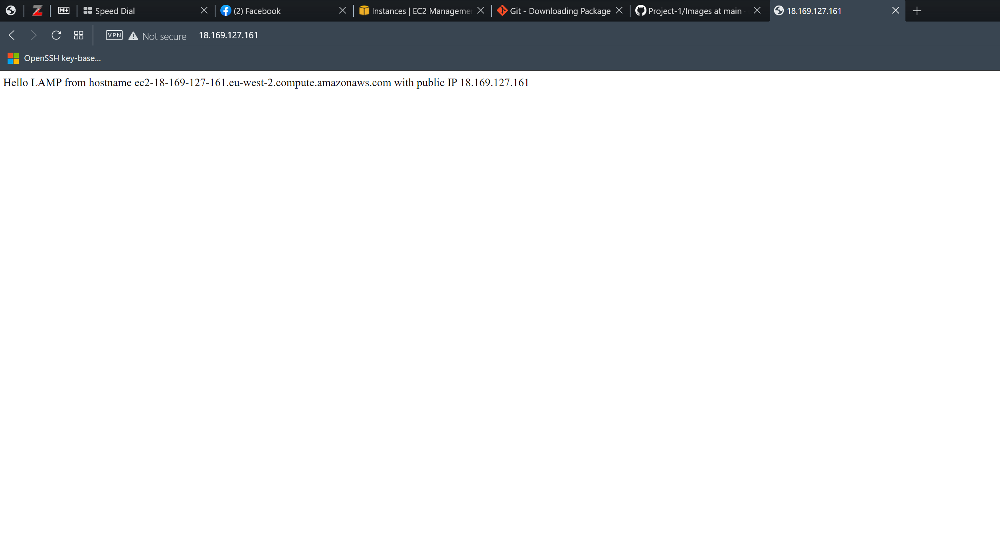

# Project-1
for Project 1

# Documentation of Project 1

## Documentation for Apache Installation

`sudo apt update`

`sudo apt install apache2`

`sudo systemctl status apache2`


Html Image for apache2 default page


## Documentation for Mysql Installation

`sudo apt install mysql-server`

`sudo mysql`


`sudo mysql_secure_installation`


## Documentation for php Installation

`sudo apt install php libapache2-mod-php php-mysql`

`php -v`


## Dcumentation on Creating Virtual Host using Apache

`sudo mkdir /var/www/projectlamp`

`sudo chown -R $USER:$USER /var/www/projectlamp`

`sudo vi /etc/apache2/sites-available/projectlamp.conf`

```
{
<VirtualHost *:80>
    ServerName projectlamp
    ServerAlias www.projectlamp 
    ServerAdmin webmaster@localhost
    DocumentRoot /var/www/projectlamp
    ErrorLog ${APACHE_LOG_DIR}/error.log
    CustomLog ${APACHE_LOG_DIR}/access.log combined
</VirtualHost>
}
```


`sudo ls /etc/apache2/sites-available`

`sudo a2ensite projectlamp`

`sudo a2dissite 000-default`

`sudo apache2ctl configtest`

`sudo systemctl reload apache2`

`sudo echo 'Hello LAMP from hostname' $(curl -s http://169.254.169.254/latest/meta-data/public-hostname) 'with public IP' $(curl -s http://169.254.169.254/latest/meta-data/public-ipv4) > /var/www/projectlamp/index.html`

| checking the status code on the browswer using http://18.169.127.161:80 |




## Documentation on enabling php on website

`sudo vim /etc/apache2/mods-enabled/dir.conf`

```
{
<IfModule mod_dir.c>
        DirectoryIndex index.php index.html index.cgi index.pl index.xhtml index.htm
</IfModule>
}
```

`sudo systemctl reload apache2`

`vim /var/www/projectlamp/index.php`


```
{
<?php
phpinfo();
}
```

| checking the status code on the browswer using http://18.169.127.161:80 |


